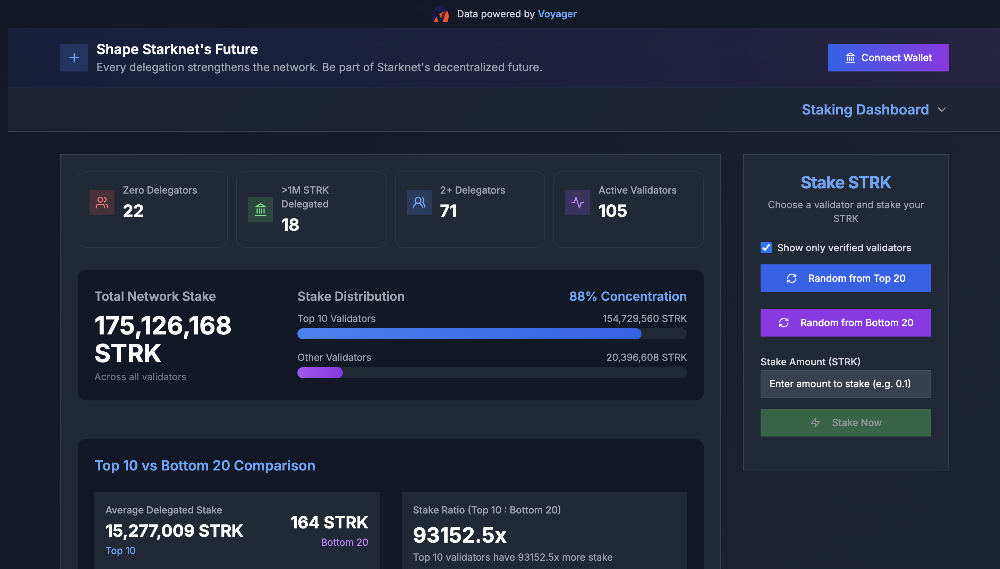

# 🎯 AlignedStake

> Making Starknet's staking more decentralized, one delegation at a time 🌱



## 🌟 What is AlignedStake?

AlignedStake is a tool designed to promote decentralization in Starknet's staking ecosystem. By providing insights into staking distribution and encouraging delegations to smaller validators, we aim to create a more balanced and resilient network.

## 🎲 Key Features

- 📊 Real-time analytics of Starknet's delegation distribution
- 🎯 Random validator selection from lower-stake pools
- 📈 Track delegation concentration metrics
- 🤝 Support emerging validators
- 📊 Stake Positions Dashboard


## 🚧 Project Status

This project is currently under active development. We're working hard to bring you:

- [X] Validator selection algorithm
- [X] Stake distribution dashboard
- [X] Easy delegation interface
- [x] Staking positions by validator
- [X] Rewards metric
- [X] Signal Unstake
- [in progress] Unstake
- [ ] Switch pool
- [ ] Claim rewards
- [ ] Native RPC ETL 
- [X] Decentralization metric ratio bar
- [ ] Validator performance metrics (v2)

## 🚀 Getting Started

To set up the project, follow these steps:

1. **Run PostgreSQL with Docker Compose**:
   - Ensure Docker is installed on your machine.
   - Navigate to the project directory and run:
     ```bash
     docker-compose up -d
     ```

2. **Initialize the Database**:
   - Open the provided Jupyter notebook.
   - Execute the first two cells to fill the database with initial data (Thanks Voayager for the data, working on a in house parser using native RPC).

3. **Start the Development Server**:
   - Navigate to the `page` folder:
     ```bash
     cd page
     ```
   - Run the development server:
     ```bash
     npm run dev
     ```

Now, you should be able to access the application and explore its features.

## 💡 Why AlignedStake?

When networks become too centralized, they become vulnerable. By helping you discover and stake with smaller, reliable validators, we're working together to make Starknet stronger and more decentralized.

## 🌐 Join the Movement

Help us create a more decentralized Starknet by considering smaller validators for your delegations. Every stake counts! 

---

⚡ Built with love for the Starknet community 💜 
